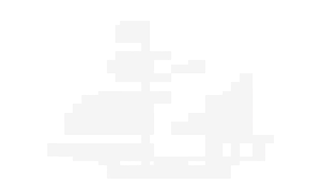
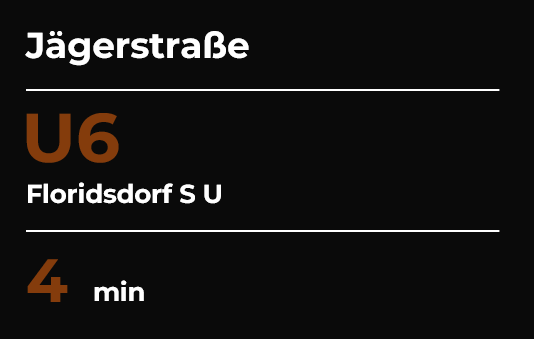
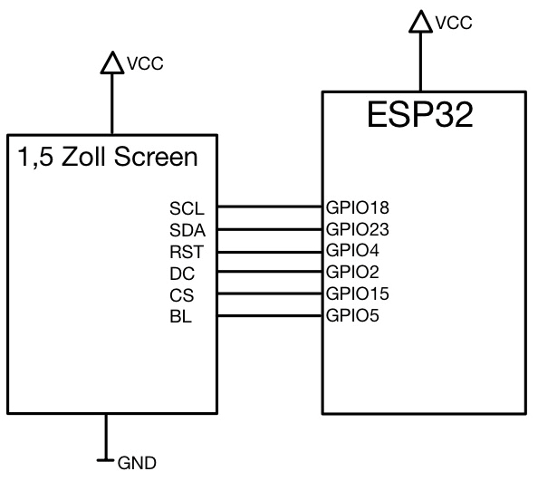

Lies mich!

## Wiener-Linien-Abfahrtsmonitor - boat

Ersteller: Andreas Oprea, Emir Kaya, Raphael Ackerler

## Motivation

Jedes Mal das Smartphone zu zücken, die App öffnen, Haltestelle suchen ist zeitraubend und umständlich beim Aufbrechen 

###### Die Lösung:

Ein kleines TFT-Display im Vorraum zeigt permanent die nächsten Abfahrten, immer
aktuell, kein Smartphone nötig

Wir benutzen 2 ESP Module, einen Sender und einen Empfänger ESP, Ein 1,54″ Zoll TFT Farbdisplay (240 x 240 px, ST7789), Open Gov Data (Wiener Linien API) OHNE API Keys (Frei zugänglich)

## Systemarchitektur

+ Wiener Linien OGD API (HTTPS/TLS) -> JSON Antwort

+ Sender ESP32 WLAN + Server (API, JSON) -> Webserver, Prefs

+ Funk ESP-NOW 2,4 GHz (kabellos, kein Router) -> Struct < Bytes an:

+ Empfänger/Getter ESP32 ESP-NOW + TFT (Callback, Phasen) -> TFT-Treiber

+ Ausgabe am ST7789 1,54″ TFT Display (240px x 240px) -> 16-Bit Farbe

## Verwendete Protokolle/Faktoren

+ Sender: WLAN, HTTPS, Webserver, Preferences, ESP-NOW

+ Empfänger: ESP-NOW, Display, Kein WLAN, Phasen, Chip

+ Display: Auflösung, Interface, Farbe, Bibliothek, Pins

## Sender ESP32

+ HTTPS Aufruf der Wiener Linien OGD-API, TLS gesicherter HTTP GET alle 30 s.

+ JSON Parser: ArduinoJSON v6: 16KB DynamicJsonDocument, extrahiert Linie, Richtung, Countdown, Station

+ Webserver: RBL-Konfiguration: Eingebauter HTTP Server, Haltestellen RBL (Stationsnummer) über Browser konfigurierbar

+ NVS PREFERENCES: Persistente Speicherung: RBL Nummern  im Flash gespeichert, bleibt nach Neustart erhalten

## Empfänger ESP32

##### Displayphasen

+ Splash Screen (Logo): Start Sequenz mit Logo ~ 3 Sekunden

+ IP Anzeige (Konfigurationshinweis): Zeigt IP Adresse des Webserver im verbundenen WLAN an um ihn aufzurufen ~ 16 Sekunden

+ Abfahrtsanzeige im Dauerbetrieb: Zeigt die Abfahrten an ~ kontinuierlich

## ESP-NOW

+ Peer Registrierung mit MAC Adresse vom Getter wird im Sender Code fest hinterlegt und per esp_now_add_peer() registriert

+ WiFi Kanal synchronisieren: Vor esp_now_init() muss WLAN Kanal explizit gesetzt werden damit beide Module auf gleichem Kanal kommunizieren

+ Protokoll Daten: Max. Payload 250 Bytes, Latenz unter 1ms, Reichweite ~220m

## Wiener Linien API

GET https://www.wienerlinien.at/ogd_realtime/monitor? **rbl=1252**

Die **RBL Nummer** (Rechnergestütztes Betriebsleitsystem) identifiziert eindeutig eine Haltestelle, abrufbar über OGD Stammdaten oder Webserver konfigurierbar

Kein API Key, frei zugängliche Open Government Data der Stadt Wien

## Pin Belegung + Schaltplan

Serial Clock SCL: GPIO 18
Serial Data SDA: GPIO 23
Reset PIN RST: GPIO 4
Data/Command DC: GPIO 2
Chip Select CS: GPIO 15
Backlight BL: Vcc/GPIO 5

Vcc und GND standardmäßig an 3.3V PIN des ESPs Spannungsregler und GND Pin anschließen 

_Schaltplan: 1,5″ TFT Screen ↔ ESP32 Empfänger_

## Verwendete Bibliotheken

| Bibliothek          | Header                     | Typ    | Zweck                                                                                                                         |
|:------------------- |:-------------------------- |:------ |:----------------------------------------------------------------------------------------------------------------------------- |
| **Adafruit ST7789** | `<Adafruit_ST7789.h>`      | Extern | spezifische Hardware Treiber fürs TFT Display, sorgt dafür dass Befehle zur Pixeldarstellung korrekt an Controller übertragen |
| **Adafruit GFX**    | `<Adafruit_GFX.h>`         | Extern | Grafikbibliothek, Zeichenfunktionen, die Treiber nutzt (zB  setCursor, Linien, drawBitmap)                                    |
| **ArduinoJson**     | `<ArduinoJson.h>`          | Extern | API Daten Parsing mit ressourcensparendem Filter                                                                              |
| **ESP NOW**         | `<esp_now.h>`              | Intern | Drahtlose Direktkommunikation zwischen ESP32                                                                                  |
| **ESP32 WiFi**      | `<WiFi.h>`, `<esp_wifi.h>` | Intern | Hotspot Verbindung & Kanal Synchronisation                                                                                    |
| **HTTP Client**     | `<HTTPClient.h>`           | Intern | Abruf Echtzeitdaten von Wiener Linien API                                                                                     |
| **Web Server**      | `<WebServer.h>`            | Intern | Webinterfaces zu RBL Konfigurierung                                                                                           |
| **Preferences**     | `<Preferences.h>`          | Intern | Permanentspeicherung RBL in FlashSpeicher                                                                                     |
| **SPI**             | `<SPI.h>`                  | Intern | Hardware Schnittstelle Ansteuerung Displays                                                                                   |

### Anmerkungen

Beim nachbauen des Projektes könnten individuelle Fehler auftreten.

Bitte bewusstvoll und aufmerksam nachbauen und bei Komplikationen Fehler suchen/uns kontaktieren

## Bitte die richtigen WiFi Daten im Code konfigurieren (SSID + Passwort)

Achtung: Öffentliche bzw. auch authentifizierungsverpflichtende WLANs sollten vermeidet werden da nur SSID und Passwort benutzt werden können also am besten Hotspots oder Home WLANs
